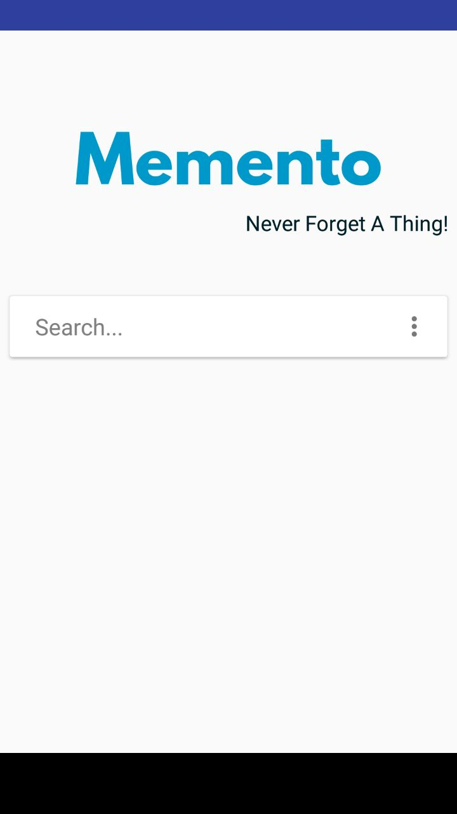
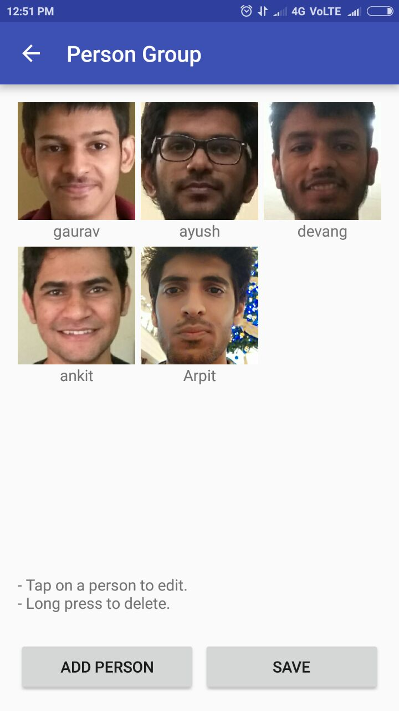
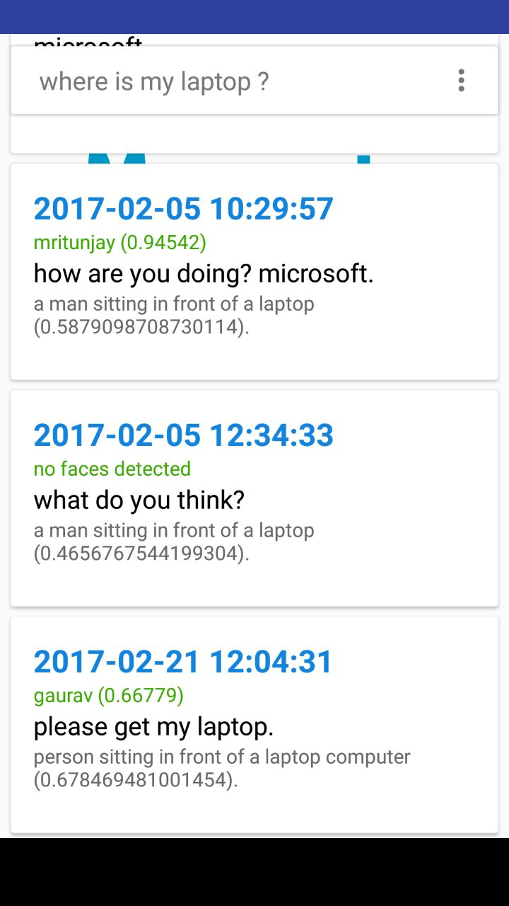

# Memento : Never Forget a Thing!

Created a Android App which serves as an AI assistant for human memory.

## Introduction

Every second of our life, we see, hear, and try to understand the world. Thanks to the autonomous subconscious mind, our experiences are automatically stored in the memory. Forgetfulness is a common ailment with most people these days, and it is only on the rise with progressive memory-related ailments such as Alzheimer's disease, amnesia, etc. due to which people tend to forgets whereabouts of the things they have used or said to someone in the past.

Memento is an AI based application which can serve as an assistant for our human memory. It can see the world and hear voices, just as humans do. It tries to understand what is happening (or at least mimic "understanding") and store its experiences in a memory chip and IT NEVER FORGETS!

 

## Approach

* Sound clips are recorded in uncompressed .wav format which is supported by Bing Speech API. Photos were resized to optimal height/width.

* We used "intent service" in android. The service requests are queued up so that they can be processed later when the app is in passive state.

* Speech, Vision and Face recognition works in parallel to enable faster processing.

* We used Microsoft Bing APIs for speech recognition, face recognition and image captioning which works on advanced deep learning algorithms.

* Each result is returned with a time stamp. Our AI algorithm analyses the results with same time stamps and combines them to return a user experience ("memory").

* We used sqlite database at the local end to store personal user experiences.

* Querying is based on simple text matching algorithm.

## Steps

Once started, the app keeps running in the background. In order to detect faces, you need to manually capture a photo of the person and provide their name using the "add people" option. This are the various functionalities in the app.

**Activation**: The app continuously monitor sound level. Whenever the sound level exceed certain threshold decibels, the app becomes active.

**Recording**: While in the active state, the app records a sound clip and captures some photos.

**Processing**: Using Speech Recognition, we convert the recorded sound clip into text. Using Image Captioning, we generate the caption for the captured photos. Using Face Recognition, we detect people in the photos.

**Understanding**: Our AI algorithm tries to understand the data and create a "memory" out of it.

**Storage**: We store the "memory" in a local sqlite database and the recorded audio and images are deleted.

**Querying**: The app supports simple querying functionality. Results are displayed in the order of decreasing probability.

**Other Features :** You can configure the various thresholds for the app in the "Setting" option. Also there is a "Log" option which allows for easy debugging.

## Conclusions

Using this app, you can ask questions regarding past events. You can also explicitly ask it to remember events and it can automatically remind you at the right time.

This app will be very useful for people suffering from amnesia.

Taking battery constraints into account, We are planning to make a special hardware device for Memento which can be used as a "plug n play" device with the smartphone. The functionality can be extended so that the app can learn to control the behaviour of your IoT devices.

## Acknowledgements

1. [Microsoft Vision API](https://www.microsoft.com/cognitive-services/en-us/computer-vision-api)
2. [Microsoft Face API](https://www.microsoft.com/cognitive-services/en-us/face-api)
3. [Microsoft Speech API](https://www.microsoft.com/cognitive-services/en-us/speech-api)

